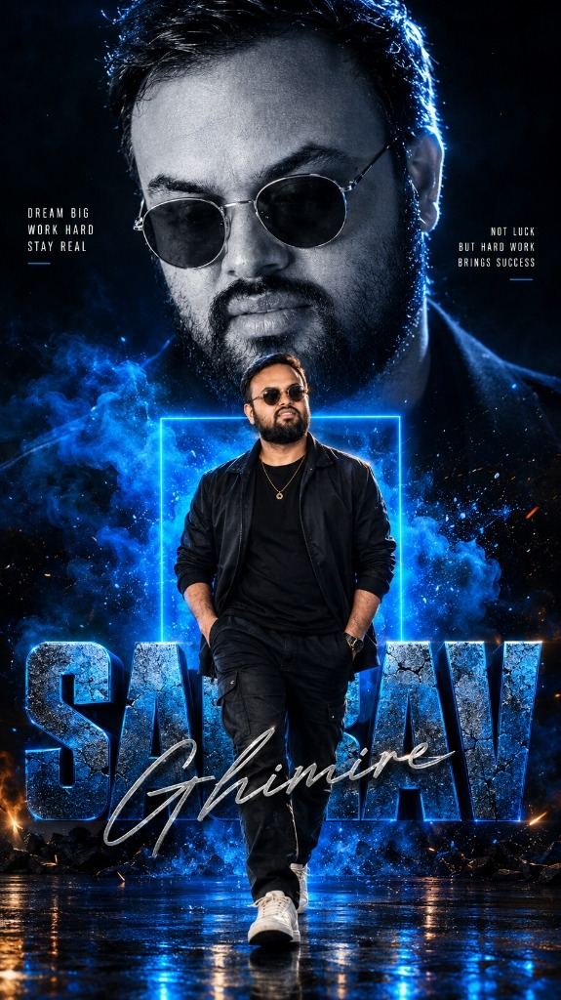
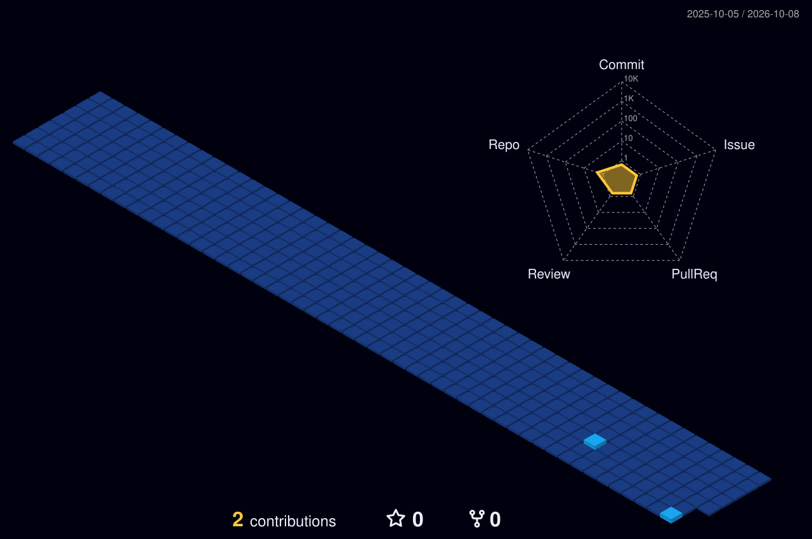

<!-- 👑 FEATURED POSTER ARTWORK -->

  

<!-- 🎬 HERO — Animated greeting + name + cycling roles -->

  

<!-- 👩‍💻 LEFT: Developer Mindset • 🏃 RIGHT: Life Beyond Code -->

  

<!-- ⚛️ TECH STACK -->

  

<!-- 🪪 DEVELOPER ID + DASHBOARD -->

  

## 🎌 Featured builds

| Project | What it is | Stack | Link |
|:---|:---|:---|:---:|
| [**AI Agent Workspace**](https://github.com/Codebymanish26) | Autonomous AI agent framework for full-stack software development | `Python` `Gemini API` `TypeScript` | ⭐ Showcase |
| [**Full-Stack Web App**](https://github.com/Codebymanish26) | High-performance interactive web experience with modern UI | `React` `Next.js` `TailwindCSS` | ⭐ Showcase |
| [**Smart Analytics Platform**](https://github.com/Codebymanish26) | Data visualization and real-time dashboard engine | `Node.js` `Express` `MongoDB` | ⭐ Showcase |
| [**Creative Motion Experience**](https://github.com/Codebymanish26) | Smooth GSAP scroll-driven interactive web experience | `HTML` `CSS` `JavaScript` `GSAP` | ⭐ Showcase |

 

## 🌃 My contribution city

*Every commit builds another tower — rebuilt automatically every day.*

  

<!-- 💌 LET'S CONNECT -->

  

 

**Dream Big · Work Hard · Stay Real** ⚡

